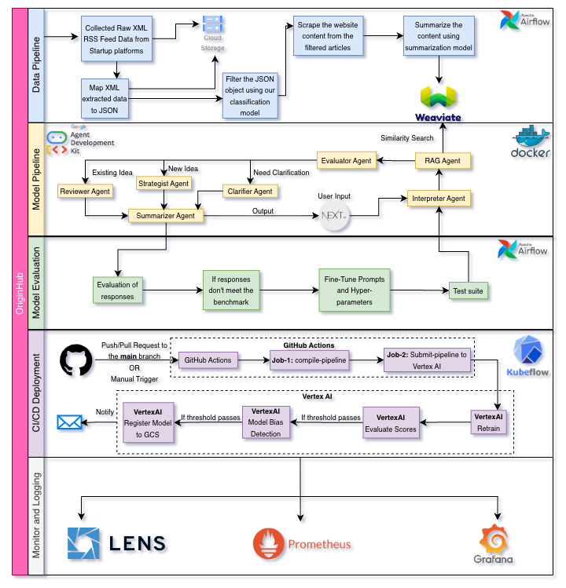

# OriginHub ML Platform

End-to-end system for discovering, evaluating, and deploying startup ideas. The stack combines a data ingestion pipeline, a multi-agent reasoning engine, automated evaluation, and a production deployment path on Google Cloud.



- **Frontend:** Deployed on Cloud Run.
- **Backend / Data Plane:** API, Postgres (+ Zalando Postgres Operator), and Weaviate run on Google Kubernetes Engine (GKE).
- **Orchestration:** Airflow for data ingestion, Kubeflow + GitHub Actions for model CI/CD, Vertex AI for evaluation/retrain, and Prometheus/Grafana/Lens for monitoring.

## OriginHub Overview and Demo

[](https://youtu.be/jx7M3-PZhE8)

## Model Deployemnt Tutorial

[](https://youtu.be/Ry5tCjiy8ao)

## What’s Inside

- **Agentic System** - Multi-agent pipeline for idea interpretation, RAG search, routing, and strategic analysis (`src/agentic/`).
- **SLM Filter** - Lightweight classifier for filtering startup ideas (`src/slm_filter/`).
- **Data Pipeline Assets** - Airflow-friendly ingestion + summarization steps, feeds into Weaviate vector DB.
- **Deployment Assets** - Dockerfiles, `docker-compose.yml` for local, and `k8s/api-deployment.yaml` for GKE.
- **CI/CD Blueprints** - GitHub Actions jobs that compile and submit Kubeflow/Vertex AI pipelines; Vertex AI gates bias/eval before retrain.

## Architecture Walkthrough

- **Data Pipeline (Airflow):** Ingest RSS/XML startup feeds → convert to JSON → classify/filter via SLM filter → scrape full text → summarize → push embeddings into Weaviate. Intermediate artifacts land in Cloud Storage.
- **Model Pipeline (ADK-powered agents):** Interpreter → RAG Agent (Weaviate) → Evaluator routes to Clarifier / Strategist / Reviewer → Summarizer produces the final report. Agents run behind the API served from GKE.
- **Model Evaluation Loop:** Automated response evaluation and test suite; if benchmarks fail, fine-tune prompts/hyperparameters and rerun tests.
- **CI/CD Deployment:** Push/PR triggers GitHub Actions → job1 compiles Kubeflow pipeline → job2 submits to Vertex AI. Vertex AI runs bias detection and score evaluation; only passing models are registered to GCS and retrained if needed. Notifications sent on pipeline completion.
- **Monitoring & Ops:** Lens for cluster visibility; Prometheus/Grafana for metrics and dashboards.

## Quick Start (Local)

```bash
python3 -m venv .venv && source .venv/bin/activate
pip install -r requirements.txt
cp .env.example .env  # fill in model + Weaviate settings
```

- **Switch backends:** See `QUICK_SETUP_OPENAI.txt` and `MODEL_BACKEND_GUIDE.md` for toggling between local GGUF, OpenAI API, and GPU transformers (`MODEL_BACKEND=llama_cpp|openai|transformers_gpu`).
- **Run agentic pipeline (CLI):** `python src/agentic/scripts/run_pipeline.py "Your idea"`
- **Interactive chat:** `python src/agentic/scripts/chat_pipeline.py`
- **REST API (local):** `python src/agentic/scripts/api_server.py` → `http://localhost:8000/docs`
- **Smoke test:** `python src/agentic/scripts/smoke_test_pipeline.py`

## Local Services with Docker Compose

```bash
docker-compose up -d  # brings up Weaviate + transformers + API
```

Defaults wire the API to Weaviate at `weaviate:8080/50051` and use OpenAI as the backend unless overridden by env vars.

## Kubernetes / GKE Deployment

- Manifest: `k8s/api-deployment.yaml` (namespace, configmap, secrets, LB service, probes).
- Image build/push: see `K8S_QUICK_DEPLOY.md` or run `docker build -f k8s/Dockerfile ...`.
- Update ConfigMap/Secret for `MODEL_BACKEND`, OpenAI keys, and Weaviate endpoints before applying.
- Backend, Postgres (+ Zalando operator), and Weaviate are expected to run on GKE; frontend is served from Cloud Run.

## CI/CD and Model Ops

- **GitHub Actions:** Two-stage workflow (compile Kubeflow pipeline, then submit to Vertex AI).
- **Vertex AI gates:** Bias detection and score evaluation; passing runs register to GCS and trigger retrain.
- **Testing:** `pytest src/agentic/tests/` (full) or `python src/agentic/scripts/smoke_test_pipeline.py` (lightweight).

## Key Configuration

- `.env.example` - API + model defaults.
- `configs/slm_filter.yaml` - Training config for the classifier.
- Environment highlights:
  - `MODEL_7B_PATH`, `MODEL_1B_PATH`, `MODEL_GPU_LAYERS`, `MODEL_CONTEXT_SIZE`
  - `WEAVIATE_HOST`, `WEAVIATE_PORT`, `WEAVIATE_GRPC_PORT`, `WEAVIATE_COLLECTION`
  - `RAG_NEW_THRESHOLD`, `AGENTIC_DEBUG`
  - `OPENAI_API_KEY` or GPU transformer settings when applicable

## Repository Map

- `src/agentic/` - Agent implementations, prompts, pipeline runners, API, ADK graph (see `src/agentic/README.md`).
- `src/slm_filter/` - Classifier training/inference code and configs.
- `docker-compose.yml` - Local stack for API + Weaviate.
- `k8s/` - GKE deployment manifests and Dockerfile.
- `K8S_QUICK_DEPLOY.md` - Step-by-step deploy to Kubernetes.
- `MODEL_BACKEND_GUIDE.md` and `QUICK_SETUP_OPENAI.txt` - Backend switching cheatsheets.

## Usage Tips

- Start with OpenAI backend for zero-GPU setup; switch to `llama_cpp` for cost control and privacy.
- If RAG novelty feels strict/lenient, tune `RAG_NEW_THRESHOLD`.
- Keep Weaviate healthy: ensure `t2v-transformers` is reachable and Prometheus alerts are green.

## Support

- Issues/bugs: GitHub Issues on this repo.
- Architecture and pipeline questions: open a Discussion or reach out to the OriginHub team.
